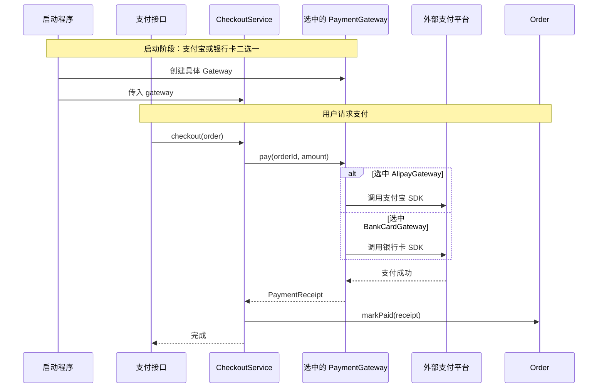

# 五门语言的面向对象：用订单支付看懂

> 不从“封装、继承、多态”的定义开始。先写一个订单支付功能，再看这些概念分别解决什么问题。

本文只使用一个案例：

- 订单有编号、金额和状态；
- 待支付订单可以选择支付宝或银行卡付款；
- 支付成功后才能把订单改为“已支付”；
- 测试不能真的扣钱，需要换成假支付实现。

第一次阅读只看第 1～7 节、第 11 节，再从第 8 节选择自己正在学的一门语言。五段语言代码不需要一次读完。

---

## 1. 先看一段容易出问题的代码

```text
order.status = "PAID"

if channel == "alipay":
    调用支付宝
else if channel == "bank_card":
    调用银行卡
```

这段代码能运行，但有四个问题：

1. 任何代码都能直接把未付款订单改成“已支付”；
2. 每增加一种支付渠道，都要修改这段 `if/else`；
3. 订单流程直接依赖支付宝和银行卡 SDK；
4. 单元测试可能真的调用外部支付系统。

接下来逐个解决。

---

## 2. 对象、类型和类到底是什么

先看两个具体订单：

```text
order_1001 = { id: "1001", amount: 9900, status: "PENDING" }
order_1002 = { id: "1002", amount: 12800, status: "PAID" }
```

- `order_1001`、`order_1002` 是两个**对象**：运行时真正存在的数据；
- `Order` 是它们的**类型**：规定订单有哪些数据和操作；
- `class` 只是某些语言定义这种类型的语法。

所以：**对象不等于 class，面向对象也不等于必须使用 class。**

| 语言 | 如何定义订单类型 | 如何给订单定义行为 |
|---|---|---|
| C++ | `class Order` 或 `struct Order` | 成员函数 |
| Go | `type Order struct` | receiver method |
| Java | `class Order` 或 `record` | 实例方法 |
| Node.js/TypeScript | `class`、普通对象或 `type` | 方法或函数 |
| Python | `class`、`dataclass` | 实例方法 |

Go 没有 `class` 关键字，但 `struct + method` 一样可以表达“一个订单拥有状态和行为”。

---

## 3. 封装：让订单不能被随便改坏

先用 Java 展示核心思路，其他语言只是语法不同：

```java
record PaymentReceipt(String id) {}

enum OrderStatus { PENDING, PAID }

final class Order {
    private final String id;
    private final long amountCents;
    private OrderStatus status;
    private String paymentId;

    Order(String id, long amountCents) {
        if (amountCents <= 0) {
            throw new IllegalArgumentException("订单金额必须大于 0");
        }
        this.id = id;
        this.amountCents = amountCents;
        this.status = OrderStatus.PENDING;
    }

    void markPaid(PaymentReceipt receipt) {
        if (status != OrderStatus.PENDING) {
            throw new IllegalStateException("订单不能重复支付");
        }
        this.status = OrderStatus.PAID;
        this.paymentId = receipt.id();
    }

    String id() { return id; }
    long amountCents() { return amountCents; }
}
```

这段代码具体保护了什么？

- 金额小于等于 0 的订单无法创建；
- 外部不能执行 `order.status = PAID`；
- 只能通过 `markPaid` 改状态；
- `markPaid` 会阻止重复支付；
- 支付编号和“已支付”状态一起更新，不会只改一半。

这才叫封装：**对象自己维护有效状态，外部只能请求它执行合法操作。**

只有 `private` 再给每个字段生成 setter，不算好的封装：

```java
order.setStatus(PAID);       // 谁都能伪造支付成功
order.setAmountCents(-100);  // 订单进入非法状态
```

五门语言的封装边界：

| 语言 | 隐藏字段的主要方式 | 必须注意 |
|---|---|---|
| C++ | `private` | 返回引用或指针时仍可能泄露可变状态和生命周期 |
| Go | 小写字段名，只允许同 package 访问 | 封装边界主要是 package，不是单个 struct |
| Java | `private`、package-private | `final` 引用不代表对象内容一定不可变 |
| Node.js/TS | JavaScript `#field`、模块闭包；TS `private` | TS `private` 主要是编译期检查，运行时通常会被擦除 |
| Python | `_name`、property、模块 API | 主要靠约定，不是不可突破的权限墙 |

---

## 4. 抽象：订单流程到底需要支付系统做什么

订单结算流程不需要知道支付宝如何签名，也不需要知道银行卡 SDK 如何建连接。它只需要一个能力：

```text
输入：订单编号、金额
输出：支付凭证
失败：返回/抛出支付错误
```

把这项能力命名为：

```text
PaymentGateway.pay(orderId, amountCents) -> PaymentReceipt
```

这里的“合同”不是法律合同，只是一条统一的方法规定：方法叫 `pay`，接收订单编号和金额，成功时返回支付凭证。

`PaymentGateway` 只规定“必须有 `pay` 方法”。`AlipayGateway` 和 `BankCardGateway` 都遵守这个规定，启动时只选择其中一个。

完整调用过程用时序图表示：



按执行顺序看就是：

1. 程序启动时创建一种支付网关并交给 `CheckoutService`；
2. 用户请求支付，接口调用 `checkout`；
3. `CheckoutService` 只调用统一的 `gateway.pay`；
4. 具体网关调用对应 SDK，成功后订单才执行 `markPaid`。

`CheckoutService` 内部始终只有同一行：

```text
receipt = gateway.pay(order.id, order.amount)
```

它不知道 gateway 最终调用支付宝还是银行卡，也不需要导入这两个 SDK。这个统一的 `pay` 规定就是抽象。

如果接口出现几十个方法，通常不是抽象得好，而是把某个 SDK 原样复制成了接口。

---

## 5. 多态：同一行调用，执行不同实现

结算流程写一次：

```text
receipt = gateway.pay(order.id, order.amount)
order.markPaid(receipt)
```

运行时传入不同对象，同一行 `gateway.pay(...)` 会执行不同代码：

```text
生产环境：gateway = AlipayGateway   → 调支付宝
另一租户：gateway = BankCardGateway → 调银行卡
单元测试：gateway = FakeGateway     → 不联网，直接返回假凭证
```

这就是最常见的运行时多态：

> 调用方只依赖共同合同，具体对象决定实际执行哪个方法。

结算流程不再写支付渠道的 `if/else`，也不再导入每个支付 SDK。

但要注意：封装、继承、多态**不是三个步骤，也不是必须同时出现的三件套**。

- `Order` 使用封装，即使没有继承和多态也有价值；
- `CheckoutService` 使用多态，是为了替换支付实现；
- 是否使用类继承，要单独判断。

---

## 6. 组合：`CheckoutService` 拥有一个支付能力

结算服务与支付网关的关系是：

```text
CheckoutService has a PaymentGateway
结算服务“拥有/使用”一个支付能力
```

代码通常通过构造函数把支付网关传进去：

```text
gateway = AlipayGateway(httpClient, config)
checkoutService = CheckoutService(gateway)
```

这叫组合，也叫构造注入。依赖直接出现在字段和构造函数里。

它解决两个实际问题：

- 生产启动时传 `AlipayGateway`；
- 测试时传 `FakeGateway`。

`CheckoutService` 不应该在内部写：

```text
gateway = new AlipayGateway()
```

否则它又和支付宝绑死，调用方也无法替换。

---

## 7. 继承：这里到底继承了什么

先区分两种经常混在一起的继承。

### 7.1 建立“可以替换”的类型关系

```text
AlipayGateway is a PaymentGateway
支付宝网关可以放到任何需要 PaymentGateway 的位置
```

各语言表达方式不同：

| 语言 | 如何建立这种关系 | 是否显式声明 |
|---|---|---|
| C++ | 公开继承抽象基类 | 是 |
| Go | 方法集自动满足 interface | 否 |
| Java | `implements PaymentGateway` | 是 |
| Node.js/TS | 对象形状满足 interface/type | 通常不需要 `implements` |
| Python | 鸭子类型或满足 `Protocol` | 不需要继承 |

这类关系的重点是“遵守 `pay` 合同”，不是复用父类代码。

### 7.2 继承父类的字段和实现

例如写一个万能支付父类：

```java
abstract class BasePaymentGateway {
    protected HttpClient client;

    PaymentReceipt pay(String orderId, long amount) {
        authenticate();
        retry();
        return doPay(orderId, amount);
    }

    protected abstract void authenticate();
    protected abstract PaymentReceipt doPay(String orderId, long amount);
}
```

看起来复用了代码，但支付宝和银行卡可能有完全不同的认证、重试和幂等规则。父类一改，所有子类都受影响。

通常更清楚的做法是组合小能力：

```text
AlipayGateway
├── HttpClient
├── AlipaySigner
└── RetryPolicy

BankCardGateway
├── BankSdkClient
└── RetryPolicy
```

这里表达的是 `has-a`，不是强行建立父子关系。

所以项目中的默认判断是：

- 为了替换实现：使用接口/Protocol/抽象合同；
- 为了复用几行代码：先考虑函数或组合；
- 只有真正稳定的 `is-a` 关系，才考虑实现继承。

Go 没有类继承。embedding 可以提升字段和方法，但外层类型并不会自动成为内层类型的子类。

---

## 8. 同一个结算流程，五门语言怎么写

下面省略支付宝 SDK 细节，只保留决定面向对象关系的代码。

先认清四个名字：

| 名字 | 它是什么 |
|---|---|
| `PaymentReceipt` | 支付成功后返回的普通数据，这里只有支付编号 |
| `PaymentGateway` | 结算流程需要的支付合同，不是一个具体支付对象 |
| `CheckoutService` | 调用支付并修改订单状态的结算流程 |
| `FakeGateway` | 测试使用的假支付对象，不联网、不扣钱 |

### 8.1 C++：抽象基类 + 引用组合

```cpp
struct PaymentReceipt {
    std::string id;
};

class PaymentGateway {
public:
    virtual ~PaymentGateway() = default;
    virtual PaymentReceipt pay(
        std::string_view order_id, long amount_cents) = 0;
};

class CheckoutService {
public:
    explicit CheckoutService(PaymentGateway& gateway)
        : gateway_(gateway) {}

    void checkout(Order& order) {
        auto receipt = gateway_.pay(order.id(), order.amount_cents());
        order.mark_paid(receipt);
    }

private:
    PaymentGateway& gateway_;
};

class FakeGateway final : public PaymentGateway {
public:
    PaymentReceipt pay(std::string_view, long) override {
        return {"test-payment-1"};
    }
};
```

发生了什么：

- `CheckoutService` 保存 `PaymentGateway&`，不拥有该对象；
- `FakeGateway` 公开继承并覆盖 `pay`；
- 通过基类引用调用时，虚函数在运行时选择具体实现；
- 调用方必须保证 gateway 比 service 活得久。

### 8.2 Go：小 interface + struct 组合

```go
type PaymentReceipt struct {
    ID string
}

type PaymentGateway interface {
    Pay(ctx context.Context, orderID string, amountCents int64) (PaymentReceipt, error)
}

type CheckoutService struct {
    gateway PaymentGateway
}

func NewCheckoutService(gateway PaymentGateway) *CheckoutService {
    return &CheckoutService{gateway: gateway}
}

func (s *CheckoutService) Checkout(ctx context.Context, order *Order) error {
    receipt, err := s.gateway.Pay(ctx, order.ID(), order.AmountCents())
    if err != nil {
        return err
    }
    return order.MarkPaid(receipt)
}

type FakeGateway struct{}

func (FakeGateway) Pay(context.Context, string, int64) (PaymentReceipt, error) {
    return PaymentReceipt{ID: "test-payment-1"}, nil
}
```

发生了什么：

- Go 没有 `implements`；`FakeGateway` 有匹配的 `Pay` 方法，就自动满足接口；
- 接口由使用它的结算模块定义，只包含一个 `Pay`；
- `CheckoutService` 通过字段组合接口；
- 这已经具有封装、抽象和多态，不需要 class 或继承。

### 8.3 Java：interface + 构造注入

```java
record PaymentReceipt(String id) {}

interface PaymentGateway {
    PaymentReceipt pay(String orderId, long amountCents);
}

final class CheckoutService {
    private final PaymentGateway gateway;

    CheckoutService(PaymentGateway gateway) {
        this.gateway = Objects.requireNonNull(gateway);
    }

    void checkout(Order order) {
        var receipt = gateway.pay(order.id(), order.amountCents());
        order.markPaid(receipt);
    }
}

final class FakeGateway implements PaymentGateway {
    public PaymentReceipt pay(String orderId, long amountCents) {
        return new PaymentReceipt("test-payment-1");
    }
}
```

发生了什么：

- `implements` 表示遵守接口，不会继承 `PaymentGateway` 的字段；
- `CheckoutService` 只依赖接口；
- Spring 可以在启动配置中注入真实实现，但核心业务不需要知道 Spring；
- JVM 根据 gateway 指向的实际对象分派 `pay`。

### 8.4 Node.js / TypeScript：结构类型 + 运行时对象

```ts
type PaymentReceipt = { id: string };

interface PaymentGateway {
  pay(
    orderId: string,
    amountCents: number,
    signal: AbortSignal
  ): Promise<PaymentReceipt>;
}

class CheckoutService {
  constructor(private readonly gateway: PaymentGateway) {}

  async checkout(order: Order, signal: AbortSignal): Promise<void> {
    const receipt = await this.gateway.pay(
      order.id, order.amountCents, signal
    );
    order.markPaid(receipt);
  }
}

const fakeGateway: PaymentGateway = {
  async pay() {
    return { id: "test-payment-1" };
  }
};
```

发生了什么：

- `fakeGateway` 不需要继承任何类，只要对象形状匹配；
- TypeScript 的 `PaymentGateway` 在编译成 JavaScript 后不存在；
- 运行时真正被注入的是一个带 `pay` 方法的普通对象；
- 外部支付响应仍要做运行时校验，不能只写类型断言。

### 8.5 Python：Protocol + 鸭子类型

```python
from dataclasses import dataclass
from typing import Protocol

@dataclass(frozen=True)
class PaymentReceipt:
    id: str

class PaymentGateway(Protocol):
    async def pay(
        self, order_id: str, amount_cents: int
    ) -> PaymentReceipt: ...

class CheckoutService:
    def __init__(self, gateway: PaymentGateway) -> None:
        self._gateway = gateway

    async def checkout(self, order: Order) -> None:
        receipt = await self._gateway.pay(order.id, order.amount_cents)
        order.mark_paid(receipt)

class FakeGateway:
    async def pay(self, order_id: str, amount_cents: int) -> PaymentReceipt:
        return PaymentReceipt(id="test-payment-1")
```

发生了什么：

- `FakeGateway` 没有继承 `PaymentGateway`，但方法形状匹配；
- `Protocol` 帮助类型检查器发现错误；
- Python 运行时仍然直接查找对象的 `pay` 方法；
- 如果调用方传入没有 `pay` 的对象，通常到执行这一行时才报错。

---

## 9. 多态在底层怎么执行

调用代码都是：

```text
gateway.pay(...)
```

但程序必须找到实际对象的方法：

| 语言 | 调用时大致发生什么 |
|---|---|
| C++ | 基类指针/引用指向具体对象，通过虚函数分派信息找到覆盖后的函数 |
| Go | interface value 记录具体动态类型和值，调用该类型对应的方法 |
| Java | 引用指向具体对象，JVM 根据对象的实际类选择实现 |
| Node.js | JavaScript 在对象自身或原型链上查找 `pay` 属性并调用 |
| Python | 在对象类型和 MRO 中查找 `pay`，再绑定并调用方法 |

这些查找机制不同，但共同点是：**调用方的代码不变，实际对象可以变化。**

C++、Go、Java 可以让编译器检查接口关系；TypeScript 的接口只存在于检查阶段；Python 的 Protocol 也主要服务静态检查。

---

## 10. 什么场景不该使用接口多态

不是所有 `if/else` 都要改成接口。

订单状态只有固定几种：

```text
PENDING → PAID → SHIPPED → COMPLETED
              ↘ CANCELLED
```

这类变体是封闭的，通常更适合：

- C++：`enum class`、`std::variant`；
- Go：具名常量 + 明确的状态转换；
- Java：`enum` 或 sealed 类型；
- TypeScript：判别联合；
- Python：`Enum` + `match`。

支付渠道却可能不断增加，而且每个渠道对接不同外部系统，适合接口多态。

简单判断方法：

| 问题 | 更适合的机制 |
|---|---|
| 所有情况已经知道，只是逐一处理 | enum / variant / sealed / 判别联合 |
| 以后会增加外部实现，希望调用方不改 | interface / Protocol / 抽象基类 |
| 算法只关心类型具备某些操作 | 泛型 / template / constraint |
| 只是复用两三行无状态代码 | 普通函数 |

---

## 11. 用这个案例重新记住六个概念

| 概念 | 订单支付案例中的具体含义 |
|---|---|
| 对象 | 内存中编号为 1001 的那个订单 |
| 封装 | 只能通过 `markPaid` 合法地把订单改成已支付 |
| 抽象 | 结算流程只要求支付系统提供 `pay` |
| 多态 | 同一行 `gateway.pay` 可以调用支付宝、银行卡或假实现 |
| 组合 | `CheckoutService` 把 `PaymentGateway` 保存为依赖 |
| 继承/子类型 | 具体网关可以放到需要 `PaymentGateway` 的位置 |

面向对象不是把所有代码写进 class，而是：

> 把状态和维护状态的行为放在一起，把可能变化的实现隔在稳定合同后面。

---

## 12. 常见错误也用订单案例判断

### 只有 getter/setter

```text
order.setStatus("PAID")
```

对象没有守住业务规则，只是把字段访问换了一个写法。

### 每个类都创建一个接口

如果 `OrderFormatter` 永远只有一个实现，也不隔离外部依赖，就不必机械创建 `IOrderFormatter`。

### 在 service 内部创建具体实现

```text
CheckoutService.checkout():
    gateway = AlipayGateway()
```

这会让组合和测试替换全部失效。

### 为复用代码建立深继承树

```text
BaseGateway
  └── HttpGateway
       └── RetryableGateway
            └── AlipayGateway
```

任何父类变化都可能影响所有子类。小函数和组合通常更直接。

### 把框架对象传进核心业务

让 `Order` 直接依赖 HTTP Request、ORM Entity 或支付 SDK，会让业务规则无法脱离框架测试。

---

## 13. 面试时可以这样回答

> 封装是让 Order 自己维护金额和状态不变量，外部不能直接伪造已支付。CheckoutService 只依赖 PaymentGateway 的 pay 合同，通过组合接收具体实现。生产环境可以传支付宝或银行卡实现，测试传 FakeGateway；同一行 pay 调用根据实际对象执行不同代码，这就是运行时多态。这里不需要复用父类实现，所以优先接口加组合，而不是建立支付类继承树。

继续追问时要能回答：

1. 为什么 `private + setter` 不等于封装？
2. Go 没有 class 和继承，为什么仍能实现封装和多态？
3. Java 的 `implements` 与 `extends` 有什么区别？
4. TypeScript interface 和 Python Protocol 在运行时是否存在？
5. 为什么订单状态适合 enum，而支付渠道适合接口？
6. C++ 中 gateway 的所有权和生命周期由谁保证？

---

## 语言内详细学习

- [C++：面向对象与抽象](../languages/cpp/05-面向对象与抽象.md)
- [Go：面向对象与抽象](../languages/go/05-面向对象与抽象.md)
- [Java：面向对象与抽象](../languages/java/05-面向对象与抽象.md)
- [Node.js / TypeScript：面向对象与抽象](../languages/nodejs/05-面向对象与抽象.md)
- [Python：面向对象与抽象](../languages/python/05-面向对象与抽象.md)
