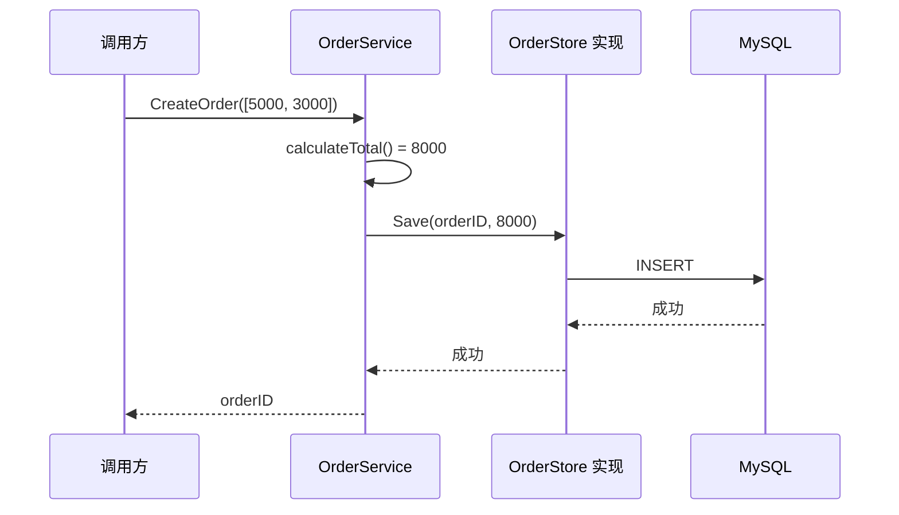

# 同一个订单模块，在五门语言中怎么写

> 目标：通过同一个“创建订单”功能，看懂 C++、Go、Java、Node.js/TypeScript、Python 如何组织功能模块，以及它们在公开入口、内部实现、依赖接口和启动组装上的差异。

读完后，你应该能够：

1. 在五门语言中找到订单模块的公开入口和内部代码；
2. 看懂 `OrderService`、`OrderStore` 和 MySQL 实现之间的关系；
3. 把一种语言中的功能模块翻译成另一种语言的惯用写法。

阅读顺序：先看第 1、7、8 节，再选择自己正在学习的一门语言查看实现。

---

## 1. 五门语言实现完全相同的功能

订单模块只做一件事：创建订单。

```text
输入：商品金额列表，例如 [5000, 3000]
处理：计算总金额 8000
保存：通过 Store 写入数据库
输出：订单编号
```

模块对外只开放：

```text
CreateOrder(command) -> orderID
```

模块内部包含：

```text
calculateTotal(...)    # 计算金额
OrderStore             # 订单模块需要的存储能力
MySqlOrderStore        # Store 的 MySQL 实现
newOrderID()           # 生成订单编号
```

所有语言都表达下面这组关系：

```text
调用方
  │
  │ CreateOrder
  ▼
OrderService
  ├── calculateTotal（内部函数）
  └── OrderStore.Save（存储接口）
             ▲
             │ 实现
      MySqlOrderStore
```

对比重点不是谁的目录名更漂亮，而是：

1. 功能模块用什么表示？
2. 哪段代码是公开入口？
3. 内部函数如何隐藏？
4. 存储接口如何定义和实现？
5. 启动时如何把 MySQL 实现传给订单服务？

---

## 2. C++：公共头文件 + 私有源码 + CMake target

### 目录

```text
order/
├── CMakeLists.txt
├── include/order/
│   ├── order_service.h     # 对外入口
│   └── order_store.h       # 组装时需要的存储接口
└── src/
    ├── order_service.cpp   # 业务实现
    └── calculate_total.h   # 私有代码

order_mysql/
├── mysql_order_store.h
└── mysql_order_store.cpp
```

### 公开代码

```cpp
// include/order/order_store.h
class OrderStore {
public:
    virtual ~OrderStore() = default;
    virtual void save(
        std::string_view order_id,
        std::int64_t total_cents) = 0;
};

// include/order/order_service.h
struct CreateOrderCommand {
    std::vector<std::int64_t> item_amounts;
};

class OrderService {
public:
    explicit OrderService(OrderStore& store);
    std::string create(const CreateOrderCommand& command);

private:
    OrderStore& store_;
};
```

其他 target 可以包含这些公共头文件。

### 内部代码

```cpp
// src/order_service.cpp
namespace {
std::int64_t calculate_total(
    const std::vector<std::int64_t>& amounts) {
    return std::accumulate(amounts.begin(), amounts.end(), 0LL);
}
} // 匿名 namespace：只在当前 .cpp 可见

std::string OrderService::create(const CreateOrderCommand& command) {
    auto total = calculate_total(command.item_amounts);
    auto id = new_order_id();
    store_.save(id, total);
    return id;
}
```

### 启动时组装

```cpp
MySqlOrderStore store{database};
OrderService service{store};
```

C++ 的模块边界主要来自：

- `include` 中的公共头文件；
- `src` 中的私有实现；
- `public/private`；
- CMake target 允许链接谁、允许看到哪些 include 目录。

只分目录、所有源码却仍编进一个巨大 target，不算真正隔离。

---

## 3. Go：package + 大小写导出规则

### 目录

```text
internal/order/
├── service.go          # 公开 Service、Command 和内部 store 接口
├── total.go            # 内部计算
└── mysql/
    └── store.go        # MySQL 实现
```

### 订单 package

```go
package order

type CreateOrderCommand struct {
    ItemAmounts []int64
}

// orderStore 由使用它的订单 package 定义，不向包外导出名字。
type orderStore interface {
    Save(ctx context.Context, orderID string, totalCents int64) error
}

type Service struct {
    store orderStore
}

func NewService(store orderStore) *Service {
    return &Service{store: store}
}

func (s *Service) Create(
    ctx context.Context,
    command CreateOrderCommand,
) (string, error) {
    total := calculateTotal(command.ItemAmounts)
    id := newOrderID()
    if err := s.store.Save(ctx, id, total); err != nil {
        return "", err
    }
    return id, nil
}

func calculateTotal(amounts []int64) int64 {
    var total int64
    for _, amount := range amounts {
        total += amount
    }
    return total
}
```

`Service`、`Create` 首字母大写，包外可见；`store`、`calculateTotal` 首字母小写，只在当前 package 可见。

### MySQL 实现

```go
package mysql

type Store struct {
    db *sql.DB
}

func NewStore(db *sql.DB) *Store {
    return &Store{db: db}
}

func (s *Store) Save(
    ctx context.Context,
    orderID string,
    totalCents int64,
) error {
    _, err := s.db.ExecContext(
        ctx,
        "INSERT INTO orders(id, total_cents) VALUES (?, ?)",
        orderID, totalCents,
    )
    return err
}
```

Go 不需要写 `implements order.orderStore`，MySQL package 甚至不需要知道这个私有接口的名字。`mysql.Store` 具有相同的 `Save` 方法，传入 `NewService` 时编译器就会检查它是否满足接口。

### 启动时组装

```go
store := mysql.NewStore(db)
service := order.NewService(store)
```

Go 的模块边界主要来自：

- package；
- 大写/小写导出规则；
- `internal` 目录限制；
- 编译器禁止循环 import。

---

## 4. Java：package + 可见性 + 构建模块

先用一个 package 表达小型订单模块：

### 目录

```text
com/company/app/order/
├── OrderService.java          # public 接口
├── CreateOrderCommand.java    # public 输入类型
├── OrderModule.java           # public 组装入口
├── DefaultOrderService.java   # package-private 实现
├── OrderStore.java            # package-private 接口
└── MySqlOrderStore.java       # package-private 实现
```

### 公开代码

```java
public record CreateOrderCommand(List<Long> itemAmounts) {}

public interface OrderService {
    String create(CreateOrderCommand command);
}
```

### 内部代码

```java
interface OrderStore {
    void save(String orderId, long totalCents);
}

final class DefaultOrderService implements OrderService {
    private final OrderStore store;

    DefaultOrderService(OrderStore store) {
        this.store = store;
    }

    @Override
    public String create(CreateOrderCommand command) {
        long total = command.itemAmounts()
            .stream()
            .mapToLong(Long::longValue)
            .sum();
        String id = newOrderId();
        store.save(id, total);
        return id;
    }
}
```

`DefaultOrderService` 和 `OrderStore` 没有 `public`，只能在同一个 package 使用。

### 启动时组装

模块提供一个公开工厂，外部不需要看到内部类：

```java
public final class OrderModule {
    public static OrderService create(DataSource dataSource) {
        var store = new MySqlOrderStore(dataSource);
        return new DefaultOrderService(store);
    }
}

OrderService service = OrderModule.create(dataSource);
```

Java 的模块边界主要来自：

- `public`、`private`、package-private；
- package；
- Maven/Gradle module 的依赖；
- 需要更强限制时使用 JPMS 或 ArchUnit。

注意：Java 的子 package 不是父 package 的内部成员，`order.persistence` 不能自动访问 `order` 的 package-private 类型。

---

## 5. Node.js / TypeScript：模块文件 + `export`

### 目录

```text
src/modules/order/
├── index.ts             # 唯一公开入口
├── public.ts            # 公开类型
├── order-service.ts     # 内部实现
├── order-store.ts       # 内部接口
└── mysql-order-store.ts # 内部实现
```

### 公开入口

```ts
// public.ts
export type CreateOrderCommand = {
  itemAmounts: number[];
};

export interface OrderService {
  create(command: CreateOrderCommand): Promise<string>;
}

// index.ts
export type { CreateOrderCommand, OrderService } from "./public.js";
export { createOrderModule } from "./order-service.js";
```

其他模块统一从订单入口导入：

```ts
import { createOrderModule } from "@/modules/order";
```

不要深层导入：

```ts
import { MySqlOrderStore } from "@/modules/order/mysql-order-store";
```

### 内部代码

```ts
interface OrderStore {
  save(orderId: string, totalCents: number): Promise<void>;
}

class DefaultOrderService implements OrderService {
  constructor(private readonly store: OrderStore) {}

  async create(command: CreateOrderCommand): Promise<string> {
    const total = command.itemAmounts.reduce((sum, n) => sum + n, 0);
    const id = newOrderId();
    await this.store.save(id, total);
    return id;
  }
}

export function createOrderModule(db: Database): OrderService {
  const store = new MySqlOrderStore(db);
  return new DefaultOrderService(store);
}
```

TypeScript 的 `interface` 编译后会消失。运行时真正存在的是带 `save` 方法的 JavaScript 对象。

Node.js/TypeScript 的模块边界主要来自：

- ES module 的 `export`/`import`；
- 统一的 `index.ts` 入口；
- package `exports`；
- ESLint 禁止深层导入和跨模块导入。

只建 `index.ts` 但允许其他代码随意深层 import，边界仍然只是约定。

---

## 6. Python：package + `__init__.py` + 约定

### 目录

```text
src/company_app/modules/order/
├── __init__.py         # 公开入口
├── public.py           # 公开类型
├── _service.py         # 内部实现
├── _store.py           # 内部 Protocol
└── _mysql_store.py     # 内部实现
```

### 公开入口

```python
# __init__.py
from .public import CreateOrderCommand, OrderService
from ._service import create_order_module

__all__ = [
    "CreateOrderCommand",
    "OrderService",
    "create_order_module",
]
```

调用方统一使用：

```python
from company_app.modules.order import create_order_module
```

### 内部代码

```python
class OrderStore(Protocol):
    async def save(
        self, order_id: str, total_cents: int
    ) -> None: ...

class DefaultOrderService:
    def __init__(self, store: OrderStore) -> None:
        self._store = store

    async def create(self, command: CreateOrderCommand) -> str:
        total = sum(command.item_amounts)
        order_id = new_order_id()
        await self._store.save(order_id, total)
        return order_id

def create_order_module(db: Database) -> OrderService:
    store = MySqlOrderStore(db)
    return DefaultOrderService(store)
```

`_service.py`、`_store.py` 的下划线表示内部文件，但 Python 仍允许调用方强行导入。它不是权限系统。

Python 的模块边界主要来自：

- package 和 `__init__.py`；
- `__all__` 与下划线命名约定；
- Protocol 和类型检查；
- lint、代码评审和必要时拆成独立 distribution。

---

## 7. 同一段代码的呈现差异

### 创建订单的方法签名

| 语言 | 代码形式 | 直接看出的差异 |
|---|---|---|
| C++ | `OrderId create(const Command&)` | 引用、所有权和异常策略需要额外约定 |
| Go | `Create(ctx, cmd) (OrderID, error)` | `context` 和错误显式返回 |
| Java | `OrderId create(Command command)` | 接口显式实现，异常可能抛出 |
| TypeScript | `create(cmd): Promise<OrderId>` | 异步使用 Promise，interface 运行时消失 |
| Python | `async def create(...) -> OrderId` | 动态运行，类型注解主要供工具检查 |

### 模块边界

| 语言 | 功能模块主要形式 | 对外公开 | 内部隐藏 |
|---|---|---|---|
| C++ | CMake target + 头文件/源码 | 公共头文件 | 私有头文件、`.cpp`、target 设置 |
| Go | package | 大写名字 | 小写名字、`internal` |
| Java | package / Gradle module | `public` | `private`、package-private、构建依赖 |
| Node.js/TS | ES module / workspace package | `export`、package `exports` | 不导出、禁止深层 import |
| Python | package / distribution | `__init__.py` 重新导出 | `_name` 约定与工具检查 |

### 存储接口

| 语言 | `OrderStore` 如何表达 | 是否必须显式声明实现 |
|---|---|---|
| C++ | 含纯虚函数的抽象基类 | 需要继承并 `override` |
| Go | interface | 不需要，方法集匹配即可 |
| Java | interface | 需要 `implements` |
| TypeScript | interface / 对象结构 | 不一定需要 `implements` |
| Python | Protocol / 鸭子类型 | 不需要继承 |

---

## 8. 五门语言运行时做的是同一件事



语言只改变代码如何声明、检查和组织，不改变这条业务调用链。

---

## 9. 什么才算模块化成功

修改订单金额计算时：

- 只修改订单模块内部代码；
- 调用方仍然使用 `CreateOrder`；
- MySQL 实现不需要知道计算规则。

把 MySQL 换成 PostgreSQL 时：

- 只替换 `OrderStore` 的具体实现；
- `OrderService` 不修改；
- 单元测试可以传入内存 Store。

模块化失败的典型表现：

- 其他模块直接导入 `MySqlOrderStore`；
- 其他模块直接修改 `orders` 表；
- `OrderService` 内部主动创建数据库连接；
- 所有内部类型都被公开；
- 目录分开了，代码却可以任意跨目录调用。

---

## 10. 看一个功能模块时检查这 6 件事

1. 对外入口是哪一个文件或类型？
2. 哪些函数和类型是内部实现？
3. 数据库、HTTP 等具体技术放在哪里？
4. 业务代码依赖接口还是直接依赖 MySQL？
5. 具体实现在哪里创建并传给业务代码？
6. 编译器、构建工具或 lint 能否阻止越界调用？

这六个问题能回答清楚，才真正看懂了一个语言的模块化方式。

---

## 延伸阅读

- [五门语言的工程结构组织对比](project-structure.md)
- [C++：模块化、依赖与 IO](../cpp/09-模块化依赖与IO.md)
- [Go：模块化、依赖与 IO](../go/09-模块化依赖与IO.md)
- [Java：模块化、依赖与 IO](../java/09-模块化依赖与IO.md)
- [Node.js：模块化、依赖与 IO](../nodejs/09-模块化依赖与IO.md)
- [Python：模块化、依赖与 IO](../python/09-模块化依赖与IO.md)
