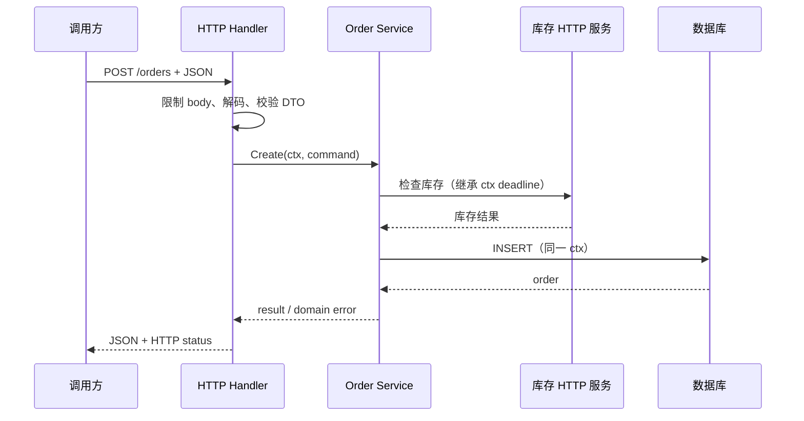

# Go：IO 与网络

> 目标：使用 `io.Reader/Writer` 处理文件和数据流，并为 HTTP、JSON 和数据库设置大小、超时、取消和资源边界。

统一场景：读取订单文件，调用库存 HTTP 服务，再把订单写入数据库。

## 1. Reader 和 Writer

Go 用小接口统一文件、网络、内存和压缩流：

```go
func CopyLimited(dst io.Writer, src io.Reader, limit int64) error {
    _, err := io.Copy(dst, io.LimitReader(src, limit))
    return err
}
```

调用方不需要知道 `src` 是文件、HTTP body 还是内存缓冲。

需要注意：

- Reader 可以分多次返回数据，一次 `Read` 不等于一条完整消息；
- 大数据按流处理，使用 `LimitReader` 等限制总量；
- 使用 `bufio.Reader/Writer` 时明确最大行长和 Flush；
- `io.Copy` 的错误必须继续返回；
- 取得 `io.Closer` 的代码通常负责关闭。

## 2. 文件

```go
file, err := os.Open(path)
if err != nil {
    return err
}
defer file.Close()

scanner := bufio.NewScanner(file)
for scanner.Scan() {
    // 解析一行订单。
}
return scanner.Err()
```

默认 Scanner token 有大小限制；处理可能很长的行时要设置合理上限或改用 Reader。写文件还要处理权限、磁盘满、Flush/Close 错误和原子替换。

## 3. HTTP client 和 server

```go
req, err := http.NewRequestWithContext(ctx, http.MethodGet, url, nil)
if err != nil {
    return err
}

resp, err := client.Do(req)
if err != nil {
    return err
}
defer resp.Body.Close()
```

- 复用 `http.Client` 和连接池，不为每个请求创建；
- context 传播 deadline 和取消；
- client 配置总体/阶段超时；
- server 配置读取、写入、空闲和 header 超时；
- 使用 `MaxBytesReader`、`LimitReader` 等限制 body；
- 检查状态码，限制并关闭响应体。

## 4. JSON 与外部数据

```go
var request CreateOrderRequest
decoder := json.NewDecoder(io.LimitReader(body, maxBodySize))
if err := decoder.Decode(&request); err != nil {
    return ErrInvalidJSON
}
```

DTO 和领域类型分开。继续校验必填、范围、数组长度、未知字段、数字精度和时间格式；类型正确不代表业务语义正确。

## 5. 数据库

```go
rows, err := db.QueryContext(ctx, query, customerID)
if err != nil {
    return err
}
defer rows.Close()

for rows.Next() {
    // Scan 一行。
}
return rows.Err()
```

- `sql.DB` 是应用级连接池；
- Rows/Tx 属于一次操作，必须关闭或提交/回滚；
- 使用参数化 SQL；
- 配置连接池容量、生命周期和获取超时；
- 通过 context 传递 deadline，但仍要确认驱动支持；
- 用真实数据库测试事务、锁和映射。

## 6. 一次订单请求如何穿过 IO 边界



每层只做自己的转换：

- handler 负责 HTTP、JSON、大小上限和状态码；
- service 负责业务顺序、领域错误和事务边界；
- HTTP/数据库 adapter 负责外部协议、连接和错误翻译；
- 同一个 `ctx` 把客户端取消和总截止时间传到底层。

不要让 service 直接接收 `http.Request`，也不要让 handler 拼 SQL。否则协议、业务和存储无法独立测试和替换。

## 7. 运行时与容量

网络调用“正在等待”时，goroutine 通常会停在 Read/Write 或 channel 操作上。Go runtime 可以通过网络轮询器让 OS 线程执行其他可运行 goroutine；但这不表示 IO 没有成本：连接、文件描述符、缓冲区、goroutine 和下游容量仍会被占用。

一次外部调用至少要回答：

1. 最长等多久，超时由哪一层设置？
2. 同时允许多少个，超出后排队还是拒绝？
3. 响应最大多大，是否按流处理？
4. 客户端取消后，调用是否跟着停止？
5. Body、Rows、Tx、文件由谁关闭？

假设数据库池最多 20 个连接，却同时启动 1,000 个查询 goroutine，吞吐不会自动提高。大部分 goroutine 只会等待连接，还会放大内存、超时和重试压力。并发上限应与连接池和下游容量一起设计。

## 8. 与其他语言对照

| 已熟悉的语言 | 可类比 | Go 中要注意 |
| --- | --- | --- |
| Java | InputStream/OutputStream、HttpClient、JDBC pool | `io.Reader/Writer` 接口更小；`context` 由参数显式向下传递 |
| Node.js | stream、fetch、连接池 | Go 的同步写法不等于占住一个 OS 线程，但 goroutine 和连接仍需限量 |
| Python | file-like object、requests/httpx、DB pool | Reader/Writer 用静态接口组合；高并发不需要把业务代码改写成 async/await |
| C++ | iostream/Asio、RAII handle | GC 不会关闭文件和连接；仍需 `Close`，通常配合 `defer` |

## 9. 常见错误

- 忘记关闭 response body、Rows 或文件；
- 假设一次 Read 得到完整消息；
- 无限制读取请求体或响应体；
- 使用默认 HTTP client 且没有总体超时策略；
- 同步地创建大量 goroutine 压垮连接池；
- 在 async/后台流程中丢失 context。

## 10. 动手验证

1. 用 `strings.NewReader` 和 `bytes.Buffer` 测试 `CopyLimited`，证明它不依赖文件；
2. 启动 `httptest.Server`，分别模拟成功、500、慢响应和超大响应；
3. 在 handler 限制请求体，发送超过上限的 JSON，确认返回稳定错误；
4. 把数据库池设为很小，逐步增加请求并发，观察等待数和延迟；
5. 在请求中途取消 context，确认 HTTP 调用、SQL 和上层 goroutine 都能退出；
6. 故意漏掉一次 `resp.Body.Close()`，用连接复用指标或 profile 观察后果。

## 11. 掌握标准

- [ ] 能用 Reader/Writer 编写不依赖具体数据源的流处理；
- [ ] 文件、HTTP 和数据库资源都在错误路径关闭；
- [ ] 外部输入有大小、字段和业务校验；
- [ ] 网络和数据库调用传递 context 并设置 deadline；
- [ ] 并发量与连接池、下游容量匹配。

package、module、依赖方向和完整仓库组织参见 [13-工程化](13-工程化.md)。

官方参考：[io](https://pkg.go.dev/io)、[net/http](https://pkg.go.dev/net/http)、[encoding/json](https://pkg.go.dev/encoding/json)、[database/sql](https://pkg.go.dev/database/sql)。
