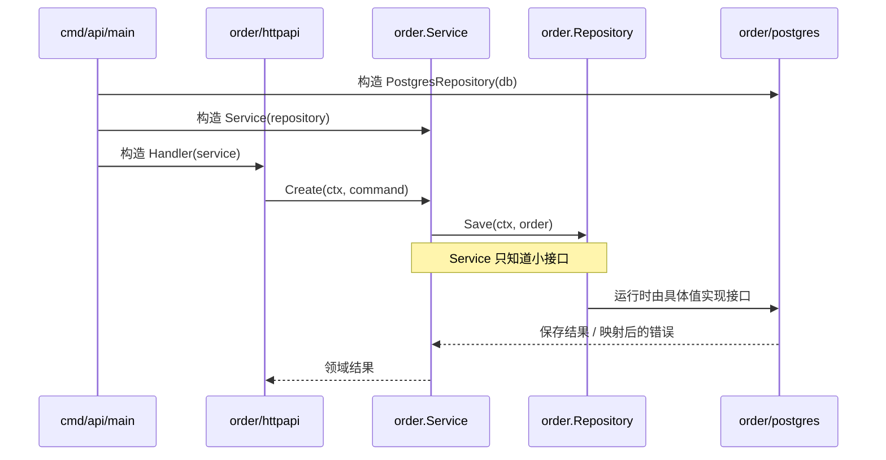

# Go：工程化

Go 企业项目的重点不是套用固定目录，而是让 package 高内聚、导入图无环、接口属于消费方、goroutine 和资源有明确生命周期。公共工程原则参见 [企业级后端项目工程结构](../../../../03-实战项目/企业级项目工程结构.md)。

## 1. 推荐结构

```text
repository/
├── go.mod
├── go.sum
├── cmd/
│   ├── api/main.go
│   ├── worker/main.go
│   └── migrate/main.go             # 确有需要时
├── internal/
│   ├── order/
│   │   ├── model.go
│   │   ├── errors.go
│   │   ├── service.go
│   │   ├── ports.go
│   │   ├── httpapi/
│   │   ├── postgres/
│   │   └── messaging/
│   ├── inventory/
│   └── platform/
│       ├── observability/
│       ├── database/
│       └── config/
├── api/                            # OpenAPI/Proto/事件 schema
├── migrations/
├── tests/
│   ├── integration/
│   ├── contract/
│   └── performance/
├── deploy/
├── ops/
├── docs/
└── tools/
```

Go 没有官方强制的企业目录模板。项目较小时，`internal/order` 可以只有几个文件；不要为了模仿其他语言创建 domain/service/repository 每层一个空 package。

## 2. package 依赖方向

```text
internal/order                 # 模型、用例、消费方接口
       ▲
       ├── order/httpapi       # 协议入口 adapter
       ├── order/postgres      # 存储 adapter
       └── order/messaging     # 消息 adapter

cmd/api 同时导入 order 与具体 adapter 完成组装
```

- `order` 不导入子 adapter package，否则容易形成 import cycle。
- `ports.go` 只定义当前 service 真正消费的小接口。
- adapter 返回/接收核心类型或边界 DTO，不让 driver 类型进入 order。
- `cmd` 显式构造数据库、client、adapter 和 service，并管理关闭顺序。
- 跨业务模块只调用对方公开能力或事件，不访问内部 map、表和实现。

## 3. internal、pkg 与 module

先区分四个层次：

| 层次 | 在 Go 中表示什么 |
| --- | --- |
| `.go` 文件 | package 的一部分，不是独立模块 |
| package | 同一目录中共同编译的一组 Go 文件，是导入和可见性边界 |
| module | 由 `go.mod` 定义的一组 package，是依赖版本单元 |
| repository | Git 仓库；可以包含一个或多个 module，但通常先从一个开始 |

最小 `go.mod`：

```go
module example.com/order-service

go 1.27
```

于是 `internal/order` 的完整导入路径是：

```go
import "example.com/order-service/internal/order"
```

- `internal` 让编译器阻止目录树外部导入，适合应用内部实现。
- 只有真正供其他 module 使用并承诺兼容的库才考虑 `pkg`；普通业务项目可以没有它。
- 一个仓库通常先使用一个 go.mod；不同部分确实需要独立版本/发布时再拆 module。
- workspace 可改善多 module 本地开发，但不能替代版本和兼容治理。

排查依赖时使用工具链，不靠肉眼翻目录：

```bash
go list -deps ./...
go list -m all
go mod why -m example.com/some/dependency
go mod graph
```

## 4. 构建与依赖管理

- `go.mod` 声明 module 路径、Go 版本和依赖版本，`go.sum` 校验下载内容。
- 使用 `go mod tidy` 维护依赖；CI 应检查执行后仓库没有未提交变化。
- 固定 Go 工具链、代码生成器和构建参数，保证开发、CI 与生产产物一致。
- 不提交只能在个人电脑生效的 `replace ../local-path`。
- 外部 SDK 放在 adapter 后面，业务 package 不直接依赖其类型和错误码。

## 5. 不使用全局容器

不要让 handler 从全局变量读取数据库、配置和 service。构造函数接收小接口或具体依赖；main 是 composition root。`init` 仅用于极少的无失败注册场景，不能创建连接、启动 goroutine 或读取环境配置。

## 6. goroutine 与进程入口

- API、Worker、Scheduler 可使用不同 `cmd`，共享内部业务 package。
- 每个进程有根 context、任务组、信号处理和总体关闭期限。
- main 按“停止接收 → cancel → wait → close”关闭资源。
- 连接池、worker、channel 和并发 semaphore 的容量在配置中显式表达。
- 不在 package import/init 时启动后台 goroutine。

## 7. 测试组织

- 同 package 测试可以验证内部细节；`package_name_test` 强制只使用公共 API。
- 表驱动单元测试覆盖领域和 service。
- adapter 测试使用真实数据库/协议容器，不能只 mock driver。
- `tests/integration` 负责多 package 和进程级场景。
- CI 运行 format、vet、test、race、fuzz（选定目标）和生产构建。
- benchmark/pprof 报告绑定固定负载，不在普通单元测试中伪装性能结论。

## 8. 项目从小到大如何演进

刚开始只有一个 API 时，不需要提前创建整棵企业目录：

```text
order-api/
├── go.mod
├── main.go
├── order.go
└── order_test.go
```

当 HTTP、数据库和业务规则开始互相干扰，再按职责拆开：

```text
order-api/
├── cmd/api/main.go
└── internal/order/
    ├── order.go          # 领域状态和规则
    ├── service.go        # 用例编排
    ├── httpapi.go        # HTTP DTO 和 handler
    └── postgres.go       # SQL 实现
```

当 `httpapi.go`、`postgres.go` 已各自形成多个文件，或需要被不同进程组合，再拆成子 package。拆分依据是“职责和依赖边界已经出现”，不是文件数量达到某个固定值。

演进原则：先让同一业务靠近，再把变化频率和外部依赖不同的部分隔开。不要从空目录模板反推业务设计。

## 9. 一个请求如何穿过工程边界



`Repository` 接口应放在使用它的 `order` package。`postgres` package 提供满足该接口的具体类型。`main` 同时认识双方并完成组装，因此业务代码不用知道驱动、DSN 或 SQL 错误码。

## 10. 配置、迁移、可观测性和发布

- 配置在进程入口一次性读取、校验并转成有类型的配置对象；不要让各 package 到处读环境变量。
- 密钥来自运行环境的 secret 机制，不写入仓库、镜像或日志。
- migration 与应用版本一起评审；涉及删列、改类型时使用向前/向后兼容的分阶段发布。
- OpenAPI、Proto 和事件 schema 是跨服务合同；生成工具版本、命令和生成产物必须可复现。
- 日志、指标和 trace 在入口建立请求上下文，在 adapter 记录外部依赖延迟；业务错误只在边界决定日志级别和协议映射。
- 构建一次不可变二进制/镜像，经过测试、预发布和生产逐级推广，不在每个环境重新编译。
- 健康检查要区分 liveness 与 readiness；停机时先取消 readiness，再停止接收并等待在途任务。
- 依赖升级需要测试、漏洞检查和变更记录，不能只追求 `go get -u` 后能编译。

## 11. 与其他语言的工程结构对照

| 语言/生态 | 常见组织方式 | 迁移到 Go 时的变化 |
| --- | --- | --- |
| Java/Spring | controller/service/repository 全局分层，容器扫描注入 | 优先按业务 package 聚合；在 `main` 显式构造依赖；接口不必一实现一接口 |
| Node.js/NestJS | module + decorator DI，运行时模块加载 | Go package 是编译期边界；module 指版本单元；避免把 DI 框架当架构 |
| Python/FastAPI | package + dependency provider，动态导入 | 导入图必须无环；公开能力由首字母大小写决定；构造错误尽早返回 |
| C++ | target/library + header/source，构建系统定义可见性 | Go package 同时承担编译和可见性边界；`internal` 由工具链强制限制导入 |

最关键的区别是：Go 的 package 不是 Java package 的纯命名空间，也不是 Node.js 的单个文件 module。一个目录中的非测试 `.go` 文件共同编译成一个 package；`go.mod` 管理的是一个版本与依赖单元。

## 12. 动手验证

1. 从单文件订单 API 开始，只在出现真实职责后拆成 `cmd/api` 和 `internal/order`；
2. 实现内存版与 Postgres 版 Repository，让 Service 测试不依赖数据库；
3. 新增 `cmd/worker`，复用订单规则，但拥有独立的并发数、根 context 和关闭期限；
4. 运行 `go list -deps ./...` 查看依赖图，确认核心业务不导入 HTTP/数据库驱动；
5. 修改一个 API schema，列出代码生成、兼容检查、测试和发布的完整证据；
6. 模拟 SIGTERM，验证 readiness、停止接收、等待和资源关闭的顺序。

## 13. 常见错误

- 全局 `handlers/services/repositories/models` 技术分层，业务变更跨越整个仓库。
- `utils`/`common` 包成为所有模块的无语义依赖。
- 在实现方预先定义巨大接口，而不是消费方小接口。
- 为解决 import cycle 把代码全部搬到一个 common 包。
- 把 context 存进长期 struct，或 package 启动无法停止的 goroutine。

## 14. 掌握标准

- [ ] package 按业务能力组织，导入图有向无环。
- [ ] 接口由消费方定义且足够小，具体实现从 cmd 注入。
- [ ] 不存在无职责的 pkg/common/utils 和隐藏 init 副作用。
- [ ] API/Worker 复用核心代码，但拥有独立容量和关闭流程。
- [ ] 单元、adapter、集成、race 和性能测试职责分开。
- [ ] go.mod/go.sum、工具链、生成代码和部署产物可复现。

官方参考：[Organizing a Go module](https://go.dev/doc/modules/layout)、[Managing dependencies](https://go.dev/doc/modules/managing-dependencies)、[Go Modules Reference](https://go.dev/ref/mod)、[How to Write Go Code](https://go.dev/doc/code)。
